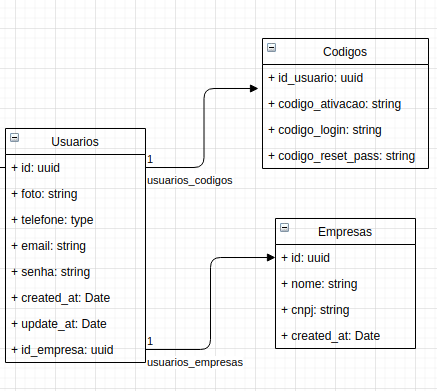

<h1 align="center">Auth Service API</h1>

  <a href="#-interface">Interface</a>&nbsp;&nbsp;&nbsp;|&nbsp;&nbsp;&nbsp;
  <a href="#-tecnologias">Tecnologias</a>&nbsp;&nbsp;&nbsp;|&nbsp;&nbsp;&nbsp;
  <a href="#-projeto">Projeto</a>&nbsp;&nbsp;&nbsp;|&nbsp;&nbsp;&nbsp;
  <a href="#-diagrama">Diagrama</a>&nbsp;&nbsp;&nbsp;|&nbsp;&nbsp;&nbsp;
  <a href="#-como-executar">Como executar</a>&nbsp;&nbsp;&nbsp;|&nbsp;&nbsp;&nbsp;
  <a href="#-licença">Licença</a>

  

  

 

## ✨ Interface

Aqui está a tabela com a descrição do 'endpoint':

| Action                    | URL                                  | Method | 
| :------------------------ | :------------------------------------| :----- | 
| Lista empresas            | /empresa/lista                       | GET    | 
| Cria usuário              | /usuario                             | POST   | 
| Ativa conta de usuário    | /usuario/ativar                      | GET    | 
| Autentica usuário         | /usuario/authenticated               | GET    | 
| Loga usuário              | /usuario/login                       | GET    | 
| Atualiza token de usuário | /usuario/refresh                     | GET    | 
| Busca infos do usuário    | /usuario/me                          | GET    | 
| Emvia e-mail cod ativação | /email/enviar/codigo/ativacao/conta  | GET    | 
| Emvia e-mail cod login    | /email/enviar/codigo/login/conta     | GET    |
| Emvia e-mail cod reset    | /email/enviar/codigo/reset/password  | GET    | 
| Solicita Reset de password| /usuario/reset/password              | GET    | 
| Reset password            | /usuario/reset/password              | POST   | 

## ✨ Tecnologias

Esse projeto foi desenvolvido com as seguintes tecnologias:

- [node: 14.16.1](https://nodejs.org/en/)
- [yarn: 1.22.10](https://yarnpkg.com/)
- [TypeScript](https://www.typescriptlang.org/)
- [TypeORM](https://typeorm.io/#/)
- [Express](https://expressjs.com/pt-br/)
- [Jest](https://jestjs.io/)
- [JSON Web Token (JWT)](https://www.luiztools.com.br/post/autenticacao-json-web-token-jwt-em-nodejs/)

## 💻 Projeto

Api para autenticação de usuário utilizando senha de dois fatores. 
Caracteristicas:
 - Desenvolvido em expressjs
 - Armazena logs
 - Está preparado para configuração multi-ambiente
 - Tem documentação swagger (localhost:3000/docs)
 - Tem alguns teste funcionais criados
 - e outras.

## 🔶 Diagrama

## 🚀 Como executar

- Instale as dependências com `yarn install`
- Inicie o servidor (desenvolvimento) `yarn start:dev`
- Inicie o servidor (produção) `yarn start:prod`

A aplicação pode ser acessada em [`localhost:3000`](http://localhost:3000).

## 📄 Licença

Esse projeto está sob a licença MIT. Veja o arquivo [LICENSE](LICENSE.md) para mais detalhes.

---

by Yuri Brasil | (91)98401-8574 👋🏻 [Para contatos](mailto:yurihotmail@hotmail.com)
